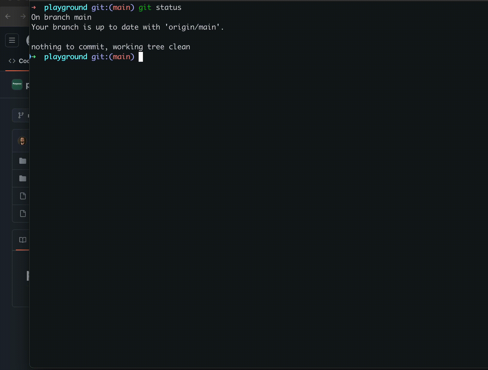

# Deploy

This script automates deployment using your local Git. It:

- Selects the branch to deploy (e.g., `main`)
- Fetches the latest changes
- Compares commits with the target branch
- Prompts for confirmation
- Merges the branch
- Tags and creates a release
- Merges the branch back into the development branch

> Run this script locally; deployment happens on the server.

## How to use it?

```txt
./deploy --help
Usage: deploy [arguments] [options]

Arguments:
  source-branch        The branch name to deploy.
  target-branch        The target branch to deploy to (optional, default: prod).
  development-branch   The development branch (optional, default: main).

Options:
  --debug              Enable debug mode (set -x).
  --dry-run            Simulate the deployment process without making any changes.
  --force              Ignore that your current local branch has ahead commits.
  -v|--version         Display current version.
  -s, --source         Specify the source branch.
  -t, --target         Specify the target branch.
  -d, --development    Specify the development branch.

Examples:
  deploy main
  deploy main --dry-run
  deploy fix/... --force
  deploy fix/... --dry-run --force
```

## Demo

### Using --dry-run



### Creating a new release


## Development

#### Source

- The entry point of the script is `./deploy`
- The source code is `src/`, split by different script files storing isolated functions.
- You can build the entire project and create a single executable script with `./build.sh`

#### Tests

The tests are inside `tests/`, using [bashunit](https://github.com/TypedDevs/bashunit/).

Use `install-dependencies.sh` to install bashunit inside your `lib/` folder
